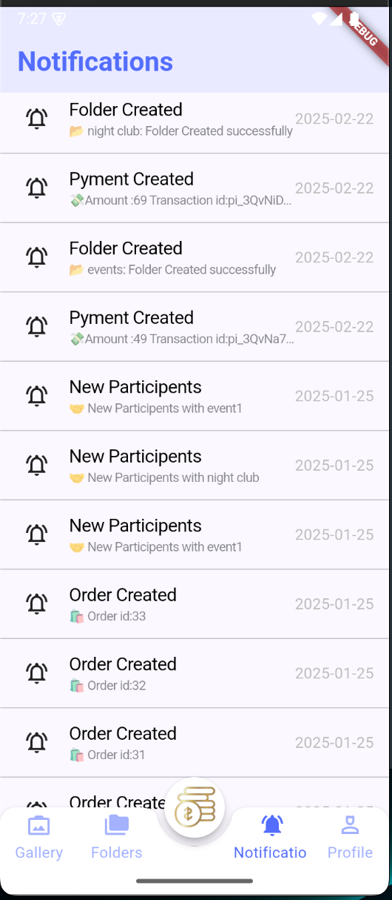

# storyforgen (for usa client).
 - by `laravel` and `flutter`

 demo Screenshots

# app side 

  - By `Flutter`

    
    
    
    
    
    
    
    
    
    
    
    
    

# admin side
  - By `Laravel`
  

## Getting Started

This project is a starting point for a Flutter application.

A few resources to get you started if this is your first Flutter project:

- [Lab: Write your first Flutter app](https://docs.flutter.dev/get-started/codelab)
- [Cookbook: Useful Flutter samples](https://docs.flutter.dev/cookbook)

For help getting started with Flutter development, view the
[online documentation](https://docs.flutter.dev/), which offers tutorials,
samples, guidance on mobile development, and a full API reference.
